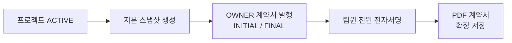

<div align="center">

# 🪙 GitEquity

**GitHub 기여 데이터로 팀원별 지분(Equity)을 자동 산출하고, 전자서명 계약까지 한 번에**

레포지토리의 커밋·PR·리뷰·이슈를 분석해 공정한 지분율을 계산하고, 확정된 지분으로 PDF 계약서 서명까지 지원하는 플랫폼입니다.

<br/>


</div>

---

## ✨ 주요 기능

| | 기능 | 설명 |
|:---:|------|------|
| 🔐 | **GitHub OAuth2 로그인** | GitHub 계정으로 즉시 로그인 |
| 📦 | **레포지토리 연동** | GitHub 레포를 프로젝트로 등록하고 팀원 초대 |
| 📊 | **기여 자동 수집** | 커밋·PR·리뷰·이슈·코멘트를 GitHub API/Webhook으로 수집<br/>*(매일 18:00 스케줄 + 실시간 Webhook)* |
| ⚖️ | **지분 계산 알고리즘** | CCN·DMM·파일 중요도·커뮤니케이션 스코어 등 다차원 품질 지표 반영 |
| 🤝 | **비코드 기여 인정(Claim)** | 멘토링·디자인·디버깅·문서/운영 등 비코드 기여를 팀원 확인 방식으로 반영 |
| 📄 | **계약서 자동 생성** | 지분율 확정 시 PDF 계약서 생성 및 전자서명 (AWS S3 저장) |
| 📧 | **이메일 알림** | 초대·서명 요청 등 이벤트 메일 발송 |

---

## 🛠 기술 스택

<table>
<tr><td><b>Backend</b></td><td>Spring Boot 3.4.5 · Java 21</td></tr>
<tr><td><b>Database</b></td><td>PostgreSQL 16</td></tr>
<tr><td><b>Security</b></td><td>Spring Security · OAuth2 · JWT</td></tr>
<tr><td><b>HTTP Client</b></td><td>Spring WebFlux (WebClient)</td></tr>
<tr><td><b>Frontend</b></td><td>React 19 · TypeScript · Vite</td></tr>
<tr><td><b>Styling</b></td><td>TailwindCSS 3</td></tr>
<tr><td><b>Data Fetching</b></td><td>TanStack React Query 5</td></tr>
<tr><td><b>Charts</b></td><td>Recharts</td></tr>
<tr><td><b>PDF</b></td><td>iText7 · html2pdf</td></tr>
<tr><td><b>Storage</b></td><td>AWS S3 (계약서)</td></tr>
<tr><td><b>Infra</b></td><td>Docker · Docker Compose · Nginx</td></tr>
</table>

---

## 📁 디렉토리 구조

```
GitEquity/
├── backend/                  # Spring Boot REST API
│   └── src/main/java/com/equicode/gitequity/
│       ├── auth/             # OAuth2, JWT 인증
│       ├── equity/           # 지분 계산 핵심 로직
│       │   ├── ccn/          #   └ 순환 복잡도 분석
│       │   ├── dmm/          #   └ 유지보수성 분석
│       │   ├── importance/   #   └ 파일 중요도
│       │   ├── quality/      #   └ 리뷰 품질, 커뮤니케이션 스코어
│       │   └── comparison/   #   └ Pearson 상관계수 비교
│       ├── github/           # GitHub API 수집 & Webhook
│       ├── project/          # 프로젝트 관리
│       ├── claim/            # 비코드 기여 인정
│       ├── contract/         # 계약서 생성 & 서명
│       └── email/            # 이메일 알림
├── frontend/                 # React SPA
│   └── src/
│       ├── api/              # Axios API 클라이언트
│       ├── pages/            # 페이지 컴포넌트
│       ├── components/       # 공통 UI 컴포넌트
│       ├── hooks/            # 커스텀 훅
│       └── types/            # TypeScript 타입 정의
├── fearson/                  # Python 분석 스크립트
└── docker-compose.yml
```

---

## 🚀 시작하기

### 사전 요구사항

- Docker & Docker Compose
- GitHub OAuth App (Client ID / Secret)
- Gmail 계정 (앱 비밀번호)

### 1️⃣ 환경변수 설정

`.env.example`을 복사하여 `.env`로 저장한 뒤 값을 채웁니다.

```bash
cp .env.example .env
```

```env
# Database
DB_USERNAME=postgres
DB_PASSWORD=your_strong_password

# JWT
JWT_SECRET=your_random_64char_secret

# GitHub OAuth
GITHUB_CLIENT_ID=your_github_oauth_client_id
GITHUB_CLIENT_SECRET=your_github_oauth_client_secret
GITHUB_WEBHOOK_SECRET=any_random_string

# URLs
OAUTH2_REDIRECT_URI=http://YOUR_SERVER_IP/oauth/callback
APP_BASE_URL=http://YOUR_SERVER_IP
ALLOWED_ORIGINS=http://YOUR_SERVER_IP

# Mail
MAIL_USERNAME=your_gmail@gmail.com
MAIL_PASSWORD=your_gmail_app_password
```

### 2️⃣ 실행

```bash
docker compose up -d
```

> 서비스가 시작되면 `http://YOUR_SERVER_IP` 에서 접근할 수 있습니다.

### 💻 로컬 개발

```bash
# Backend
cd backend
./gradlew bootRun

# Frontend
cd frontend
yarn install
yarn dev
```

---

## 📖 API 문서

백엔드 실행 후 Swagger UI에서 전체 API 명세를 확인할 수 있습니다.

🔗 http://localhost:8080/swagger-ui/index.html

---

## ⚖️ 지분 계산 방식

기여 유형별 **원점수(Raw Score)** 를 집계한 뒤, 아래 품질 지표로 가중치를 적용합니다.

| 지표 | 설명 |
|------|------|
| **CCN** | 커밋 변경 코드의 순환 복잡도 |
| **DMM** | 코드 유지보수성 (단위 크기·복잡도·인터페이스 복잡도) |
| **파일 중요도** | 변경 이력 기반 핵심 파일 가중치 |
| **리뷰 품질** | 리뷰 코멘트의 실질적 내용 점수 |
| **커뮤니케이션** | PR/이슈 코멘트의 소통 기여도 |

> 💡 비코드 기여(**Claim**)는 팀원 **과반 확인** 시 지분에 추가 반영됩니다.

---

## 📝 계약 플로우



1. 프로젝트 **ACTIVE** → 지분 스냅샷 생성
2. **OWNER** 가 계약서 발행 (INITIAL / FINAL)
3. 팀원 전원 전자서명
4. 서명 완료 시 PDF 계약서 확정 저장

<div align="center">
<br/>

**Made with ⚖️ by EquiCode**

</div>
